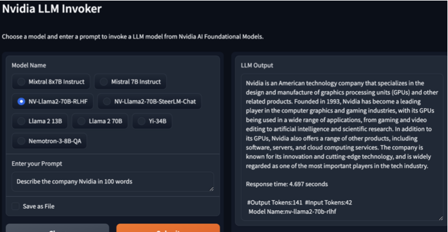
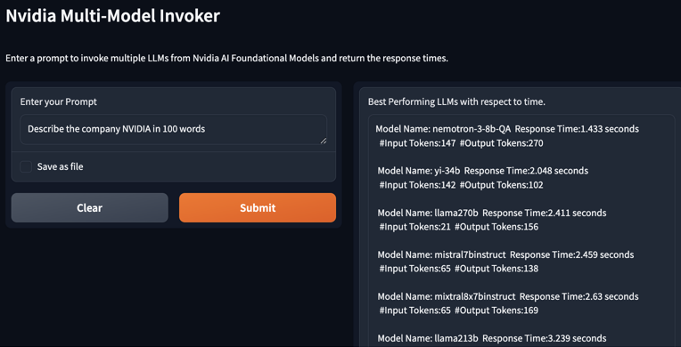

# LLM-Nvidia-Comparision
This is a demonstration of testing different LLM models on the Nvidia Foundational AI model catalog.

https://catalog.ngc.nvidia.com/ai-foundation-models

To extract through the CURL request, click on one of the model learn more sections and then click on the API section.
Then click on the generate API key and copy that key to either a .yaml or .env file that holds value.

Two notebooks demonstrate the use of these APIs through the standard request module and the other with the aiohttp module.
The notebook that features the aiohttp contains errors due to some models returning null values despite 202 status code and
because of that, it is not fully reliable.

The request notebook features the ability to benchmark multiple models over a list of prompts so that viewers can inspect which
model would suit their use cases. In addition, it features gradio interface in which the user can select which model to use with
the user input prompt to view the model response.

### Screenshots
Below is an image of the gradio interface in which you can select which LLM model and input your prompt to generate text from the LLM.

Here is another image that shows how the benchmark interface for a singular prompt works when one prompt is run against multiple LLMs.

### Additional Work

1. Extend this work performance to other types of models on the Nvidia Catalog. This was a strict text-to-text model where the model
   payloads were of the same structure.

2. Rework the async aiohttp notebook to solve for errors in calling the API in an asynchronous fashion i.e. solving for null content when the status_code is 202.

3. Extend the functionality to evaluate the metrics of each LLM under Information Retrieval metrics such as MMR, BLEU Score, ROUGE and, others.  
