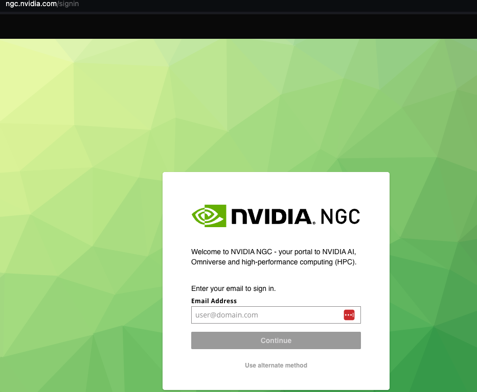

## How to access NGC API KEY for Nvidia AI foundational models.

1. Go to the web link below:

https://catalog.ngc.nvidia.com/

2. Login if you have an account or create a new account 

3. Head to AI Foundation Models on the left navigation. From there you will be taken to the catalog page where you can 
   click on the "Learn More" tab to look at a specific model.

4. Once one clicks on a model's learn more page, click on the API tab to see the example code. Click on the generate key tab to gain access to your API key.

